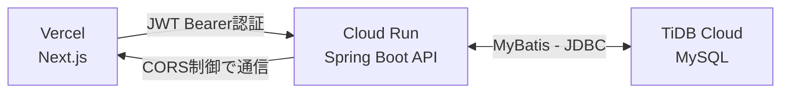
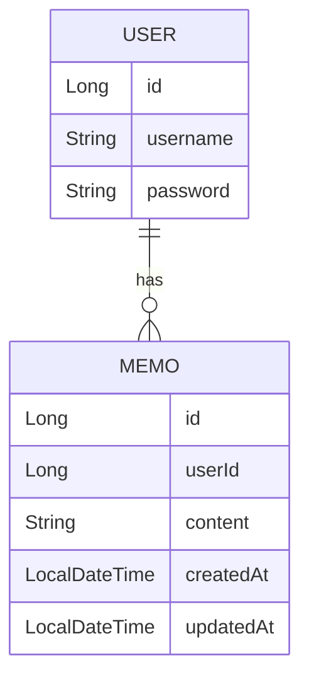

# 2Week Memo 

##  概要

セキュリティかつ、ログイン機能を備えたメモ管理アプリです。ユーザーごとにメモを保持し、最終更新から１４日経過したメモをSpring Batchで自動削除します。

約3日で設計、実装、テスト(未実施)、デプロイまでを個人で完結したポートフォリオプロジェクトです。

---

## URL

- ２WeekMemoアプリ: `https://two-week-memo-gilt.vercel.app`

---

## ⚙️ 技術スタック

| 分類 | 使用技術 |
|------|----------|
| バックエンド | Java 17.0.14 |
|| Spring Boot 3.4.4 |
| フロントエンド | TypeScript 5.x系 |
|| Next.js 15.3.0 |
|| React 19.0.0 |
| データベース | MySQL 8.0.11 |
| インフラ | Cloud Run (API) |
|| Vercel (UI) |
|| GitHub |
|| TiDB Cloud (DB) |
| 認証方式 | JJWT 0.11.5 (JWT Bearerトークン形式) |

---

## 🛠 主な機能

- JWT認証機能
- ログインしたユーザーのみメモを表示
- メモ作成 / 編集 / 削除
- 更新から１４日経過したメモの自動削除 (Spring Batch)
- シンプルでタイトルノないクリーンなUI
- メモ編集は自動更新

---

## 🔒 セキュリティ構成

本アプリは CORS と JWT による二層のリクエスト保護を採用しています。

- CORS設定により、許可されたドメインからのリクエストのみ受け付け
- JWTによる認証トークンで、認可されたユーザーのみが自分のメモにアクセス可能
- この構成により、アプリ外部からの不正リクエストを遮断しつつ、内部ではユーザーごとのアクセス制御を実現しています

---

## 🧰 システム構成図



---

## 🐎 ER図



---

## 📅 実行方法 (dev)

```bash
# backend　（backend配下で）
mvn spring-boot:run

# frontend　（frontend配下で）
npm run dev
```

---

## 補足
- フロントエンドの画面は、AIで作成しました。
- バックエンドのBatch処理においては、AIで実装だけして動作確認は未実施です。
